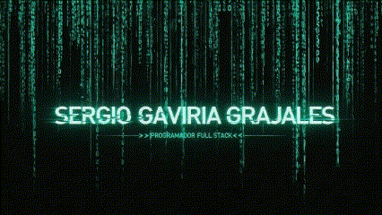

  

# 👋 ¡Hola! Soy Sergio Gaviria
### 💻 Full-Stack Developer | Amante del diseño visual y los videojuegos

Soy desarrollador web con enfoque en frontend, efectos visuales y experiencias interactivas. Este perfil y mi portfolio son parte de mi trabajo creativo.

## 🛠️ Tecnologías y herramientas

## 🌟 Proyectos destacados

- 🎯 [Mi portfolio web](https://gavi60.github.io/portfolio-fs/) – Hecho desde cero con HTML, SCSS, JS y Vite.
- 🛒 [Tienda online en WordPress](http://glclub.kesug.com/) – Proyecto con filtros y diseño responsive.
- 🎮 [Portfolio de videojuegos](https://gavi60.github.io/portfolio-vg/) – Desarrollado desde cero, incluye animaciones e interfaz personalizada.  Este proyecto demuestra mis conocimientos técnicos en desarrollo de videojuegos.

Más proyectos en mi sección de [Repositorios](https://github.com/gavi60?tab=repositories)

## 📊 GitHub Stats

## 🚀 Abierto a nuevas oportunidades

Busco oportunidades como **desarrollador web**, si es posible,  
con un enfoque especial hacia el frontend, que es lo que más disfruto.
Me interesa formar parte de proyectos donde pueda aportar valor y seguir creciendo.  

## 📬 ¿Hablamos?

